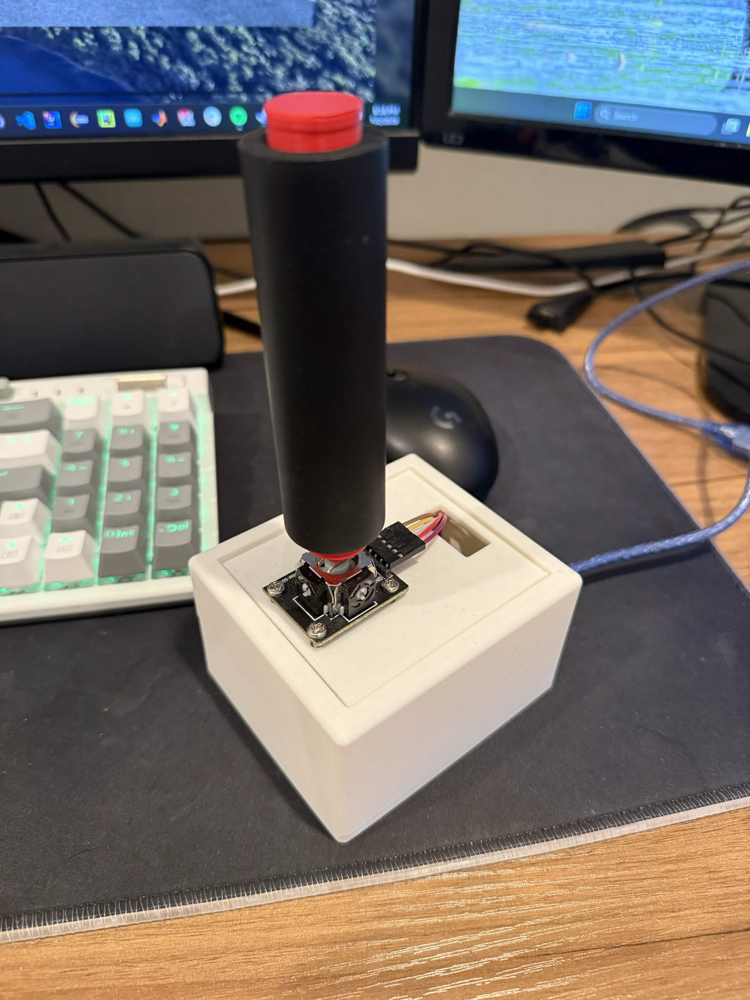
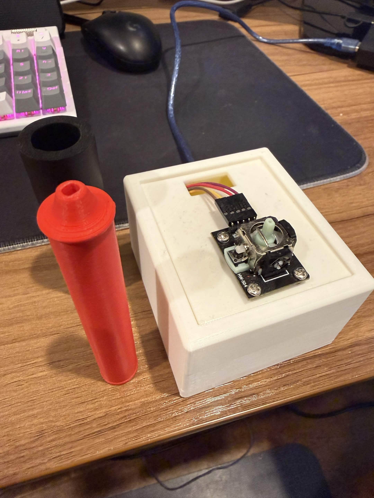
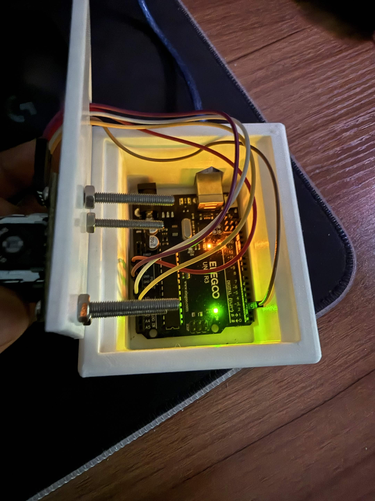
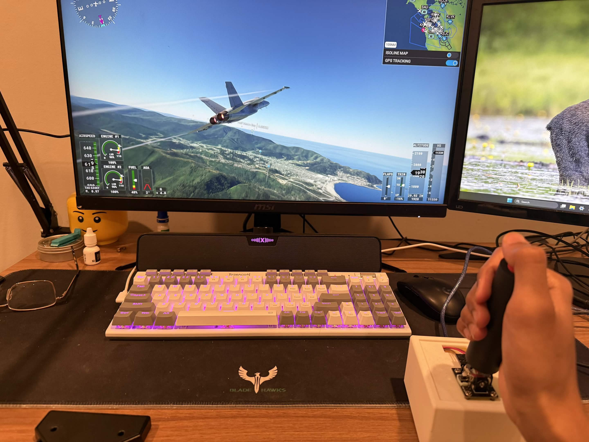
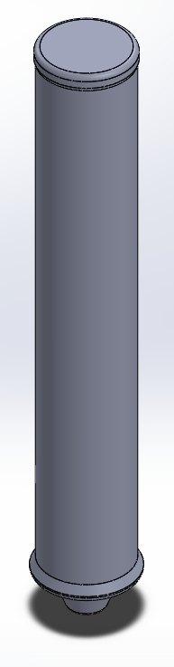
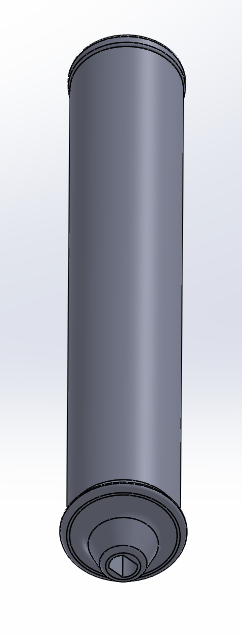
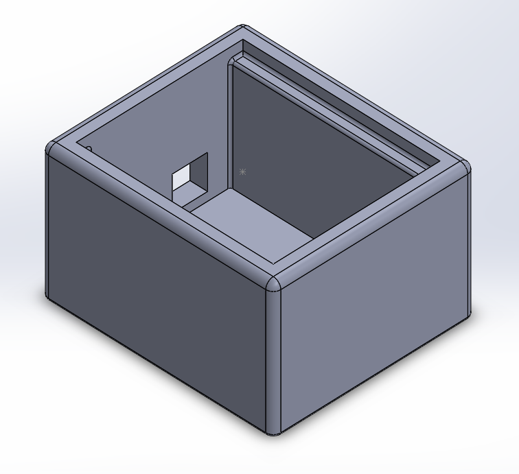
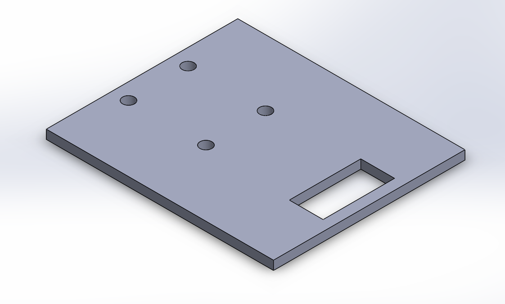

# ArduinoFlightJoystick

A custom 3D-printed joystick designed in **SOLIDWORKS** that functions as an **Xbox 360 controller** using Arduino, Python, and a virtual gamepad driver.

The Arduino reads joystick position and button input, sends the data over serial, and a Python script converts those values into inputs for a virtual Xbox controller. This allows the controller to be used with any game / flight simulator that supports Xbox controllers.

<table>
  <tr>
    <td></td>
    <td></td>
  </tr>
  <tr>
    <td></td>
    <td></td>
  </tr>
</table>

## Features

* 3D-printed joystick designed in SOLIDWORKS
* Arduino-based analog joystick and push-button input
* Serial communication at 115200 baud
* Python script for real-time input processing
* Virtual Xbox 360 controller output using `vgamepad`
* Low-latency control suitable for games and flight simulators

## Hardware

* Arduino Uno
* 2-axis analog joystick module with integrated push button
* USB cable
* 3D-printed enclosure and joystick (designed in SOLIDWORKS)

## Configuration

### Arduino

* Upload `joystick.ino` in Arduino IDE

### Python

Required packages:

```bash
pip install pyserial vgamepad
```

You'll also need the ViGEmBus driver, which `vgamepad` uses to create a virtual Xbox controller. This can be found [here]([url](https://github.com/nefarius/ViGEmBus/releases)).

## Configuration

If your Arduino appears on a different serial port, change:

```python
serial.Serial('COM5', 115200)
```

to the appropriate COM port for your system.

If your joystick axes are reversed or rotated, modify the axis mapping in `main.py`. For this specific design, the joystick is typically rotate 90 degrees, so I have mapped y Arduino values to x Xbox values and vice versa.

```python
x_xbox = map_range(y, ...)
y_xbox = map_range(x, ...)
```

## How It Works

1. The Arduino continuously reads:

   * X-axis position
   * Y-axis position
   * Joystick button state

2. The values are transmitted over the serial port in the format:

```
X, Y, Button
```

3. The Python script:

   * Reads each serial packet
   * Maps the joystick values from the Arduino's 0–1023 ADC range to the Xbox controller's signed 16-bit joystick range (-32768 to 32767)
   * Updates the virtual Xbox controller in real time
   * Maps the joystick push button to the Xbox left thumbstick click

## Design
The joystick enclosure and handle were designed in SOLIDWORKS with manufacturing tolerances in mind to ensure a reliable fit after 3D printing. The enclosure includes approximately 3-5 millimeters of clearance around the Arduino, joystick module, and lid to simplify assembly and accommodate printer dimensional variation. In contrast, the interface between the printed joystick and the Arduino joystick shaft was designed with a tighter tolerance (approximately 0.3 mm) to create a secure friction fit without requiring adhesives or additional fasteners.

<table>
  <tr>
    <td align="center">
      
      <br>
      <em>Top View</em>
    </td>
    <td align="center">
      
      <br>
      <em>Bottom View</em>
    </td>
  </tr>
</table>

<table>
  <tr>
    <td align="center">
      
      <br>
      <em>Case</em>
    </td>
    <td align="center">
      
      <br>
      <em>Lid</em>
    </td>
  </tr>
</table>

## Project Structure

```
.
├── joystick.ino      # Arduino firmware
├── main.py           # Python virtual controller interface
├── CAD/              # SOLIDWORKS files
├── STL/              # Printable model files
├── images/           # Design images (for README)
└── README.md
```

## Future Improvements

* Adjustable deadzone and sensitivity
* Additional buttons and triggers
* HID implementation without requiring Python
